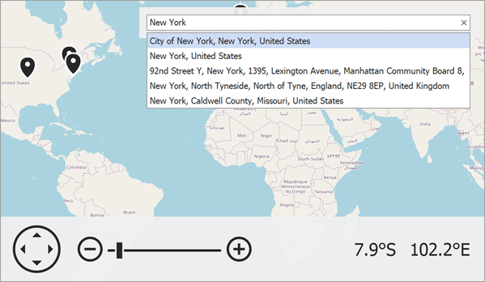

<!-- default badges list -->

<!-- default badges end -->

# Map for WinForms - Use the OpenStreetMap Search Service

This example demonstrates how to add an image layer with map tiles from the OpenStreetMap service, and an information layer uses the OpenStreetMap search service to locate a place on the map.

The example uses the following classes:

* [`ImageLayer`](https://docs.devexpress.com/WindowsForms/DevExpress.XtraMap.ImageLayer) - A layer that displays map images obtained from map image data providers.
* [`OpenStreetMapDataProvider`](https://docs.devexpress.com/WindowsForms/DevExpress.XtraMap.OpenStreetMapDataProvider) - A provider that loads map images in the OpenStreetMap format from a web resource.

    > **IMPORTANT:** Before you use OpenStreetMap tiles in your app, read the following articles: [Copyright and License](https://www.openstreetmap.org/copyright) and [Tile Usage Policy](https://operations.osmfoundation.org/policies/tiles). 

* [`InformationLayer`](https://docs.devexpress.com/WindowsForms/DevExpress.XtraMap.InformationLayer) - A layer that displays additional geo information over the map.
* [`OsmSearchDataProvider`](https://docs.devexpress.com/WindowsForms/DevExpress.XtraMap.OsmSearchDataProvider) - Allows you to use the OpenStreetMap search service.

## Files to Look At

* [MainForm.cs](./CS/OsmSearchSample/MainForm.cs) (VB: [MainForm.vb](./VB/OsmSearchSample/MainForm.vb))

## Documentation

* [Search](https://docs.devexpress.com/WindowsForms/16711/controls-and-libraries/map-control/gis-data/search?p=netframework)
* [GIS Data](https://docs.devexpress.com/WindowsForms/17858/controls-and-libraries/map-control/gis-data)
* [Image Tile Providers](https://docs.devexpress.com/WindowsForms/115774/controls-and-libraries/map-control/map-image-data/image-tile-providers)

## More Examples

* [Map for WinForms - Connect to the OpenStreetMap Service](https://github.com/DevExpress-Examples/winforms-map-connect-to-openstreetmap)
* [How to: Use the OpenStreetMap Geocode Service Via the Map Control](https://github.com/DevExpress-Examples/how-to-use-the-openstreetmap-geocode-service-via-the-map-control-t629683)
